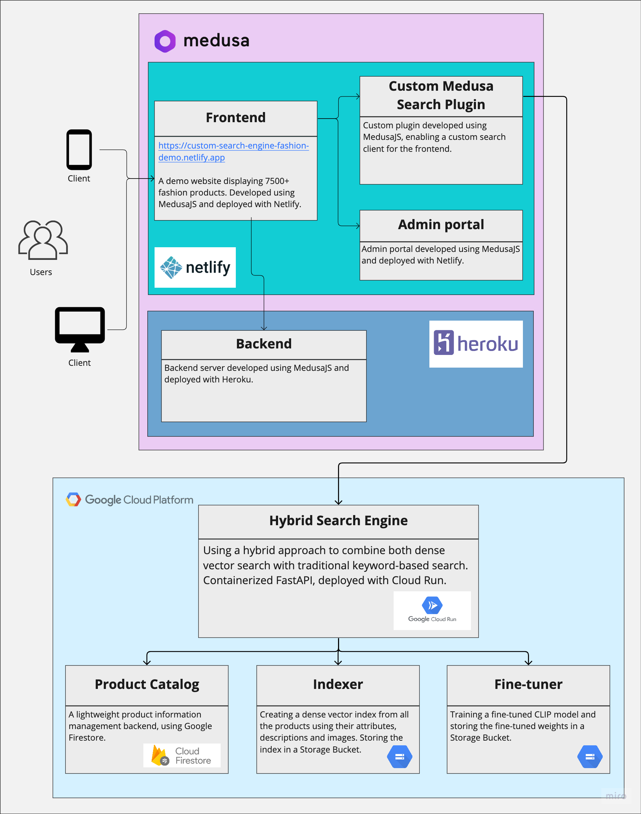

# A semantic search engine for fashion

*For fashion in an ecommerce setting, using a hybrid approach to combine both dense vector search with traditional
keyword-based search. I also build a demo website
with 7500+ fashion products. Check out the video (no sound) below:*

https://user-images.githubusercontent.com/44285698/221427212-c1589e01-c0e3-4563-aef4-4bb8c880190e.mp4

## A picture is worth a thousand words.

Yet, the traditional search engines you run into when shopping online never incorporate the product images themselves.
Using an open source ML-model (CLIP), pre-trained on more than 400 million text-image pairs, it can achieve fairly
impressive understanding of query intent. For a deep-dive into the inner workings of the search engine, check out
the [repo for the API (Docker + FastAPI)](https://github.com/msvensson222/search-api-demo1). Apart from developing
relatively advanced ML-models which is more in line with my previous experience, this side-project also exposed me to
build a full website; frontend, backend and admin portal as well as managing a product catalog. I'm using the Medusa
platform, together with deploying the app and website using Netlify and Heroku.

## Architecture
Below you can find the full system and it's components, and how they communicate.

#### Discussion

Although showing impressive semantic understanding, it still has some drawbacks. My search engine is using both vector
similarity search to find matches, as well as traditional keyword matching, forming a hybrid search engine. This results
in slower retrieval, compared to the traditional search engine since computing vector similarity is relatively time
intensive. Moreover, to improve the search results further, my search engine would need a ranking stage, leveraging user
behaviour click-data, that would re-order results based on user interaction history.

